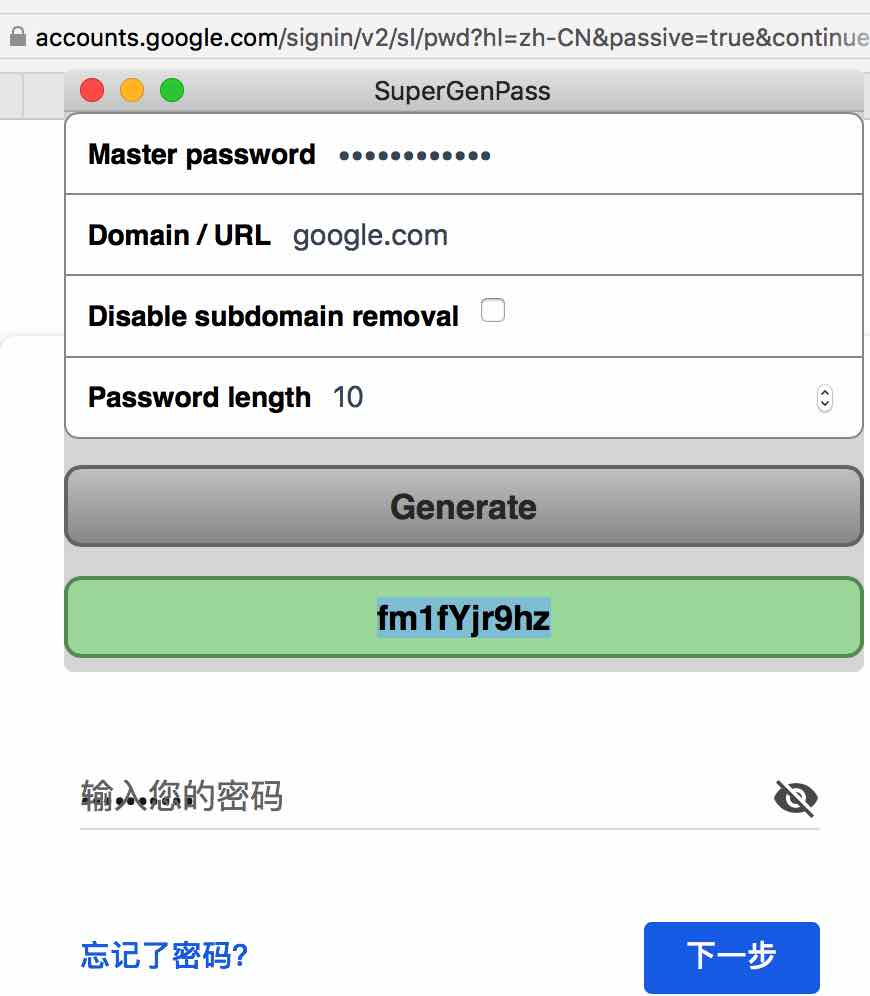

# this is a Hammerspoon plugin that implements SuperGenPass algorithm

https://github.com/chriszarate/supergenpass

http://hammerspoon.org

it support Safari and Chrome and other App  by custom defaultAppDomainMap

for Safari user: You must enable the 'Allow JavaScript from Apple Events' option in Safari's Develop menu to use 'do JavaScript'.

for Chrome user: You must enable 'Allow JavaScript from Apple Events' by going to the menu bar, View > Developer > Allow JavaScript from Apple Events

press the "Generate" button to generate the password.
you can close the window by pressing the button twice or pressing the enter/return twice.


```
local superGenPass=hs.loadSpoon("SuperGenPass")
superGenPass.showMenubar=false
superGenPass.saveGeneratedPasswordToPasteboard=false --auto save generated password to pasteboard
superGenPass.autoHideWindowAfterPasswordGenerated=false
superGenPass.autoComplete=true
superGenPass.remberMasterPassword=true -- maybe this is not safe
superGenPass:bindHotkeys({toggle={{"cmd","ctrl"},"7"}})
superGenPass.defaultAppDomainMap = {
["net.nutstore.NutstoreJavaBE"] = "jianguoyun.com",
["com.apple.iBooksX"] = "apple.com",
["com.apple.iTunes"] = "apple.com",
["com.emmac.mac"] = "www.eastmoney.com",


} 
```
